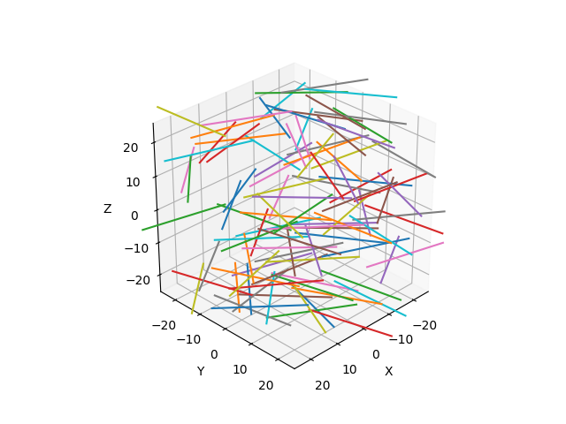

🧵 Mat(erial)
=============

Mat
---

.. autoclass:: fibermat.mat.Mat
    :members:

Example
~~~~~~~

.. code-block:: python

    import numpy as np
    from matplotlib import pyplot as plt
    from tqdm import tqdm

    from fibermat import *

    # Generate a set of fibers
    mat = Mat(100)
    # Build the fiber network
    net = Net(mat)
    # Create the fiber mesh
    mesh = Mesh(net)

    # Get fiber data
    dimensions = mat[[*"lbh"]]  # size: (n x 3)
    positions = mat[[*"xyz"]]  # size: (n x 3)
    orientations = mat[[*"uvw"]]  # size: (n x 3)

    # Check data
    Mat.check(mat)  # or `mat.check()`
    # -> returns `mat` if correct, otherwise it raises an error.

    # Figure
    fig, ax = plt.subplots(subplot_kw=dict(projection='3d', aspect='equal',
                                           xlabel="X", ylabel="Y", zlabel="Z"))
    ax.view_init(azim=45, elev=30, roll=0)
    if len(mat):
        # Draw fibers
        for i in tqdm(range(len(mat))):
            # Get fiber data
            fiber = mat.iloc[i]
            # Calculate fiber end points
            A = fiber[[*"xyz"]].values - 0.5 * fiber.l * fiber[[*"uvw"]].values
            B = fiber[[*"xyz"]].values + 0.5 * fiber.l * fiber[[*"uvw"]].values
            plt.plot(*np.c_[A, B])
        # Set drawing box dimensions
        ax.set_xlim(-0.5 * mat.attrs["size"], 0.5 * mat.attrs["size"])
        ax.set_ylim(-0.5 * mat.attrs["size"], 0.5 * mat.attrs["size"])
    plt.show()

