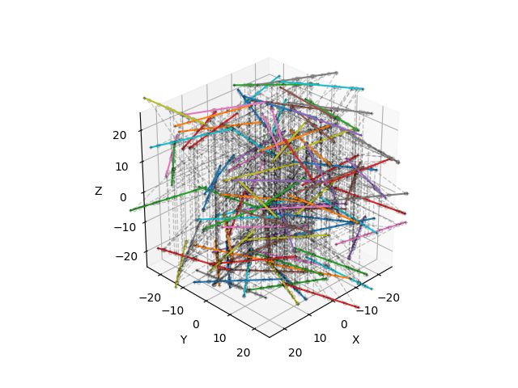

📐 Mesh
=======

Mesh
----

.. autoclass:: fibermat.mesh.Mesh
    :members:

Example
~~~~~~~

.. code-block:: python

    import numpy as np
    from matplotlib import pyplot as plt
    from tqdm import tqdm

    from fibermat import *

    # Generate a set of fibers
    mat = Mat(100)
    # Build the fiber network
    net = Net(mat, periodic=True)
    # Create the fiber mesh
    mesh = Mesh(net)

    # Check data
    Mesh.check(mesh)  # or `mesh.check()`
    # -> returns `mesh` if correct, otherwise it raises an error.

    # Figure
    fig, ax = plt.subplots(subplot_kw=dict(projection='3d', aspect='equal',
                                           xlabel="X", ylabel="Y", zlabel="Z"))
    ax.view_init(azim=45, elev=30, roll=0)
    if len(mesh):
        # Draw elements
        for i, j, k in tqdm(zip(mesh.index, mesh.beam, mesh.constraint),
                            total=len(mesh)):
            # Get element data
            a, b, c = mesh.iloc[[i, j, k]][[*"xyz"]].values
            if mesh.iloc[i].s < mesh.iloc[j].s:
                # Draw intra-fiber connection
                plt.plot(*np.c_[a, b],
                         c=plt.cm.tab10(mesh.fiber.iloc[i] % 10))
            if mesh.iloc[i].z < mesh.iloc[k].z:
                # Draw inter-fiber connection
                plt.plot(*np.c_[a, c], '--ok',
                         lw=1, mfc='none', ms=3, alpha=0.2)
            if mesh.iloc[i].fiber == mesh.iloc[k].fiber:
                # Draw fiber end nodes
                plt.plot(*np.c_[a, c], '+k', ms=3, alpha=0.2)
    # Set drawing box dimensions
    ax.set_xlim(-0.5 * mesh.attrs["size"], 0.5 * mesh.attrs["size"])
    ax.set_ylim(-0.5 * mesh.attrs["size"], 0.5 * mesh.attrs["size"])
    plt.show()

