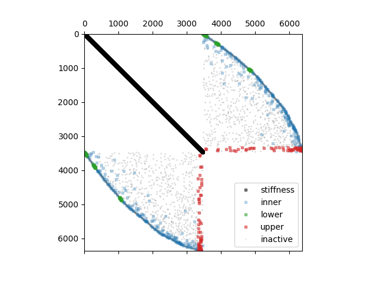

🔧 Model
========

stiffness
~~~~~~~~~

.. autofunction:: fibermat.model.stiffness

constraint
~~~~~~~~~~

.. autofunction:: fibermat.model.constraint

plot_system
~~~~~~~~~~~

.. autofunction:: fibermat.model.plot_system

Example
~~~~~~~

.. code-block:: python

    import numpy as np
    from matplotlib import pyplot as plt

    from fibermat import *

    # Linear model (Ψ² ≫ 1)
    mat = Mat(1, length=1, width=1, thickness=1, shear=1, tensile=np.inf)
    net = Net(mat)
    mesh = Mesh(net)
    print("Linear (Ψ² ≫ 1) =")
    print(4 / np.pi * stiffness(mat, mesh, coupling=1)[0].todense())
    print()

    # Timoshenko model (Ψ² = 1)
    mat = Mat(1, length=1, width=1, thickness=1, shear=2, tensile=2)
    net = Net(mat)
    mesh = Mesh(net)
    print("Timoshenko (Ψ² = 1) = 1 / 2 *")
    print(4 / np.pi * stiffness(mat, mesh, coupling=1)[0].todense())
    print()

    # Euler model (Ψ² ≪ 1)
    mat = Mat(1, length=1, width=1, thickness=1, shear=1e12, tensile=12)
    net = Net(mat)
    mesh = Mesh(net)
    print("Euler (Ψ² ≪ 1) = 1 / 12 *")
    print(4 / np.pi * stiffness(mat, mesh, coupling=1)[0].todense())
    print()

    # Generate a set of fibers
    mat = Mat(100)
    # Build the fiber network
    net = Net(mat)
    # Stack fibers
    stack = Stack(mat, net)
    # Create the fiber mesh
    mesh = Mesh(stack)

    # Assembly quadratic programming system
    K, u, F, du, dF = stiffness(mat, mesh)
    C, f, H, df, dH = constraint(mat, mesh)
    plot_system(K, u, F, du, dF, C, f, H, df, dH)
    plt.show()

.. code-block::

    Linear (Ψ² ≫ 1) =
        [[ 1.   0.5 -1.   0.5]
         [ 0.5  inf -0.5 -inf]
         [-1.  -0.5  1.  -0.5]
         [ 0.5 -inf -0.5  inf]]

    Timoshenko (Ψ² = 1) = 1 / 2 *
        [[ 1.          0.5        -1.          0.5       ]
         [ 0.5         1.33333333 -0.5        -0.83333333]
         [-1.         -0.5         1.         -0.5       ]
         [ 0.5        -0.83333333 -0.5         1.33333333]]

    Euler (Ψ² ≪ 1) = 1 / 12 *
        [[ 12.   6. -12.   6.]
         [  6.   4.  -6.   2.]
         [-12.  -6.  12.  -6.]
         [  6.   2.  -6.   4.]]

    2.888979232532619e-13

