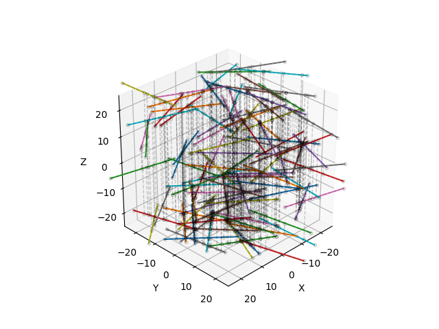
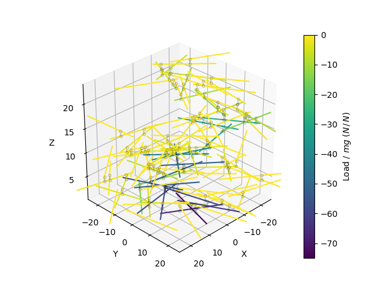

🕸️ Net(work)
============

Net
---

.. autoclass:: fibermat.net.Net
    :members:

Example
~~~~~~~

.. code-block:: python

    import numpy as np
    from matplotlib import pyplot as plt
    from tqdm import tqdm

    from fibermat import *

    # Generate a set of fibers
    mat = Mat(100)
    # Build the fiber network
    net = Net(mat, periodic=False)

    # Get node data
    pairs = net[[*"AB"]].values  # size: (n x 2)
    abscissa = net[["sA", "sB"]].values.reshape(-1, 2, 1)  # size: (n x 2 x 1)
    points = (net[["xA", "yA", "zA", "xB", "yB", "zB"]]
              .values.reshape(-1, 2, 3))  # size: (n x 2 x 3)

    # Check data
    Net.check(net)  # or `net.check()`
    # -> returns `net` if correct, otherwise it raises an error.

    # Figure
    fig, ax = plt.subplots(subplot_kw=dict(projection='3d', aspect='equal',
                                           xlabel="X", ylabel="Y", zlabel="Z"))
    ax.view_init(azim=45, elev=30, roll=0)
    if len(mat):
        # Draw fibers
        for i in tqdm(range(len(mat))):
            # Get fiber data
            fiber = mat.iloc[i]
            # Calculate fiber end points
            A = fiber[[*"xyz"]].values - 0.5 * fiber.l * fiber[[*"uvw"]].values
            B = fiber[[*"xyz"]].values + 0.5 * fiber.l * fiber[[*"uvw"]].values
            plt.plot(*np.c_[A, B])
    if len(net):
        # Draw nodes
        for point in tqdm(points):
            plt.plot(*point.T, '--ok', lw=1, mfc='none', ms=3, alpha=0.2)
    # Set drawing box dimensions
    ax.set_xlim(-0.5 * net.attrs["size"], 0.5 * net.attrs["size"])
    ax.set_ylim(-0.5 * net.attrs["size"], 0.5 * net.attrs["size"])
    plt.show()

--------------------------------------------------------------------------------

Stack
-----

.. autoclass:: fibermat.net.Stack
    :members:

Example
~~~~~~~

.. code-block:: python

    import numpy as np
    from matplotlib import pyplot as plt
    from scipy.interpolate import interp1d
    from tqdm import tqdm

    from fibermat import *

    # Generate a set of fibers
    mat = Mat(100)
    # Build the fiber network
    net = Net(mat, periodic=False)
    # Stack fibers
    stack = Stack(mat, net)

    # Get the linear system
    C, f, H, h = Stack.constraint(mat, net)
    linsol = Stack.solve(mat, net)
    # Contact force
    force = linsol.ineqlin.marginals
    # Resulting force
    load = 0.5 * force @ np.abs(C) + 0.5 * force @ C

    # Check data
    Stack.check(stack)  # or `stack.check()`
    # -> returns `stack` if correct, otherwise it raises an error.

    # Normalize by fiber weight
    load /= np.pi / 4 * mat[[*"lbh"]].prod(axis=1).mean()
    # Get loaded nodes
    points = (stack[stack.A < stack.B][["xA", "yA", "zA", "xB", "yB", "zB"]]
              .values.reshape(-1, 2, 3))
    # Prepare color scale
    cmap = plt.cm.viridis
    color = interp1d([np.min(load), np.max(load)], [0, 1])

    # Figure
    fig, ax = plt.subplots(subplot_kw=dict(projection='3d', aspect='equal',
                                           xlabel="X", ylabel="Y", zlabel="Z"))
    ax.view_init(azim=45, elev=30, roll=0)
    if len(mat):
        # Draw fibers
        for i in tqdm(range(len(mat))):
            # Get fiber data
            fiber = mat.iloc[i]
            # Calculate fiber end points
            A = fiber[[*"xyz"]].values - 0.5 * fiber.l * fiber[[*"uvw"]].values
            B = fiber[[*"xyz"]].values + 0.5 * fiber.l * fiber[[*"uvw"]].values
            plt.plot(*np.c_[A, B], c=cmap(color(load[i])))
    if len(points):
        # Draw contacts
        for point in tqdm(points[~np.isclose(force, 0)]):
            plt.plot(*point.T, '--ok', lw=1, mfc='none', ms=3, alpha=0.2)
    # Set drawing box dimensions
    ax.set_xlim(-0.5 * mat.attrs["size"], 0.5 * mat.attrs["size"])
    ax.set_ylim(-0.5 * mat.attrs["size"], 0.5 * mat.attrs["size"])
    # Add a color bar
    norm = plt.Normalize(vmin=np.min(load), vmax=np.max(load))
    smap = plt.cm.ScalarMappable(cmap=cmap, norm=norm)
    cbar = plt.colorbar(smap, ax=ax)
    cbar.set_label("Load / $mg$ ($N\,/\,N$)")
    plt.show()

