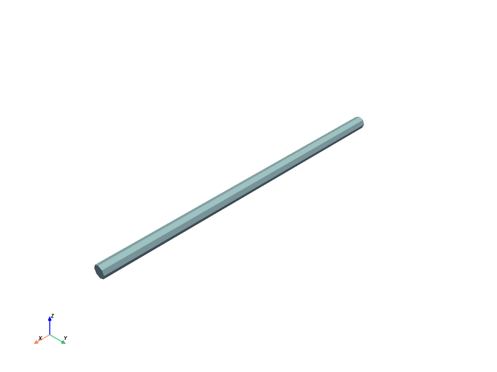
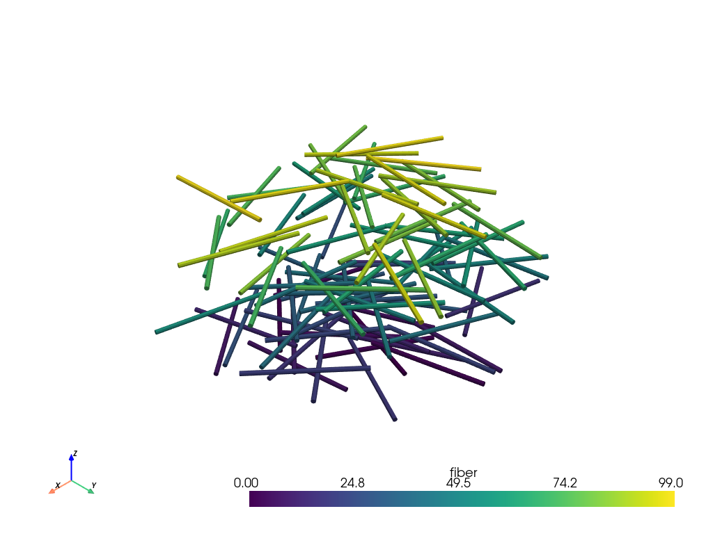
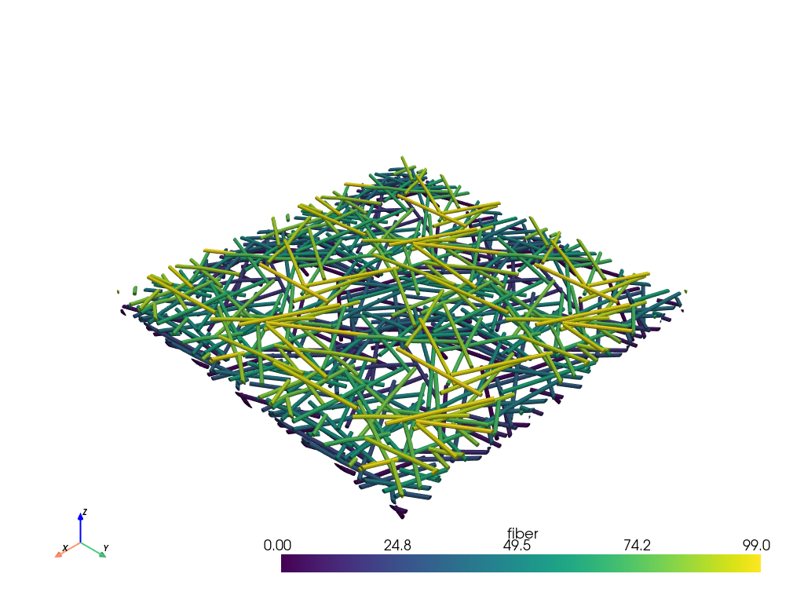
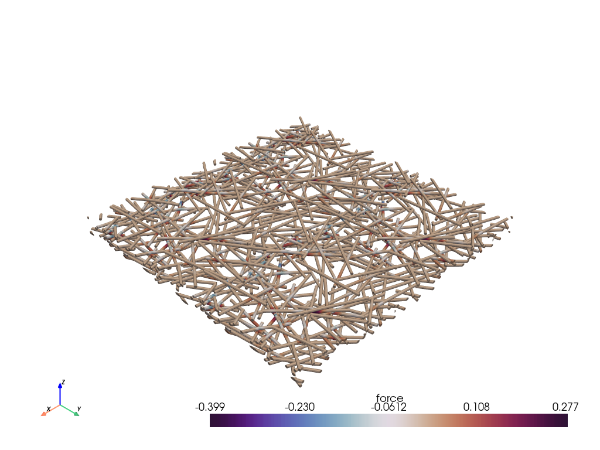

🌐 Render
=========

vtk_fiber
~~~~~~~~~

.. autofunction:: fibermat.render.vtk_fiber

vtk_mat
~~~~~~~

.. autofunction:: fibermat.render.vtk_mat

vtk_mesh
~~~~~~~~

.. autofunction:: fibermat.render.vtk_mesh

Example
~~~~~~~

.. code-block:: python

    from matplotlib import pyplot as plt

    from fibermat import *

    # Create a VTK fiber
    vtk_fiber().plot()

    # Generate a set of fibers
    mat = Mat(100)
    # Build the fiber network
    net = Net(mat, periodic=True)
    # Stack fibers
    stack = Stack(mat, net)
    # Create the fiber mesh
    mesh = Mesh(stack)

    # Create a VTK mat
    vtk_mat(mat).plot()

    # Create a VTK mesh
    vtk_mesh(mat, mesh).plot()

    # Solve the mechanical packing problem
    K, C, u, f, F, H, Z, rlambda, mask, err = solver(
        mat, mesh, packing=4, lmin=0.01, coupling=0.99
    )

    # Export as VTK
    vtk = vtk_mesh(mat, mesh,
                   *u(1).reshape(-1, 2).T,
                   *(f(1) @ C).reshape(-1, 2).T)
    vtk.plot(scalars="force", cmap=plt.cm.twilight_shifted)

