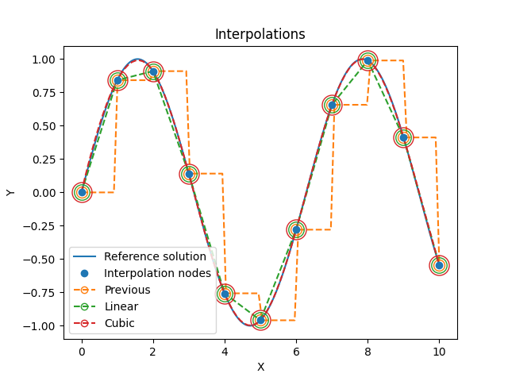

📈 Interpolation
================

interpolate
~~~~~~~~~~~

.. autoclass:: fibermat.interpolation.Interpolate
    :members: __call__

Example
~~~~~~~

.. code-block:: python

    import numpy as np
    from matplotlib import pyplot as plt

    from fibermat import *

    # Reference solution
    x = np.linspace(0, 10, 1001)
    y = np.sin(x)

    # Interpolation nodes
    X = x[::100]
    Y = y[::100]

    # Interpolated functions
    f_ = Interpolate(Y, size=11, kind='previous')
    g_ = Interpolate(Y, size=11, kind='linear')
    h_ = Interpolate(Y, size=11, kind='cubic')
    x_ = Interpolate(X, size=11)
    t = np.linspace(0, 1, 100)

    # Figure
    plt.figure()
    p, = plt.plot(x, y, label="Reference solution")
    plt.plot(X, Y, 'o', color=p.get_color(), zorder=np.inf, label="Interpolation nodes")
    p, = plt.plot(x_(t), f_(t), '--')
    plt.plot(x_(), f_(), 'o', ms=10, mfc='none', c=p.get_color())
    plt.plot([], [], 'o--', mfc='none', c=p.get_color(), label="Previous")
    p, = plt.plot(x_(t), g_(t), '--')
    plt.plot(x_(), g_(), 'o', ms=14, mfc='none', c=p.get_color())
    plt.plot([], [], 'o--', mfc='none', c=p.get_color(), label="Linear")
    p, = plt.plot(x_(t), h_(t), '--')
    plt.plot(x_(), h_(), 'o', ms=18, mfc='none', c=p.get_color())
    plt.plot([], [], 'o--', mfc='none', c=p.get_color(), label="Cubic")
    plt.xlabel("X")
    plt.ylabel("Y")
    plt.legend()
    plt.title("Interpolations")
    plt.show()

